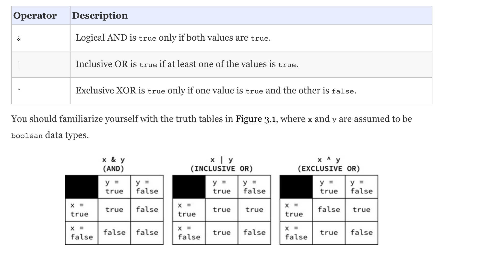
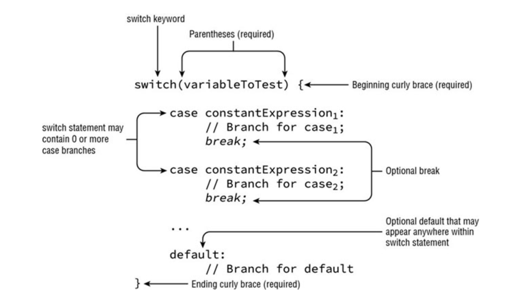
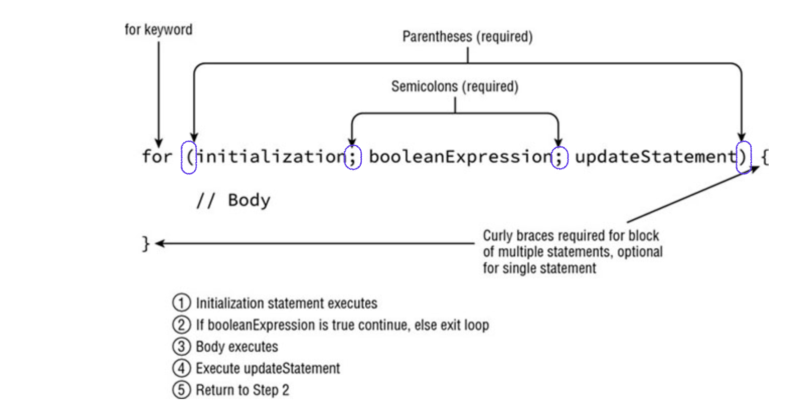
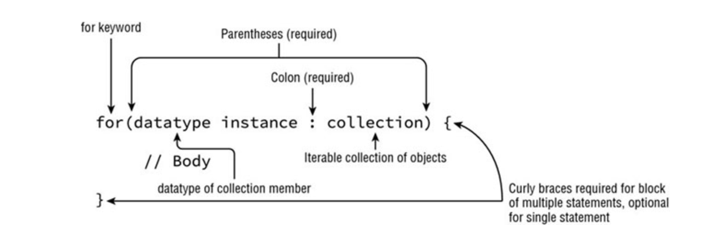

# JAVA 11 OCP CERTIFICATION (1ZO-819) PREPARATION NOTES 

## Introduction
This repository contains complete notes about OCP 1ZO-819 certification, you can contribute to it either adding/updating notes by raising PRs.

## Resources

### Books

* Oracle Certified Professional 11 Developer Complete : [Oracle-Certified-Professional-Developer-Complete](https://www.amazon.com/Oracle-Certified-Professional-Developer-Complete/dp/1119619130)
* Selikoff website : [https://www.selikoff.net/](https://www.selikoff.net/java-11-books/) 

## Notes

## Chapter 1: History

Will write this later

## Chapter 2: Java building blocks "you have to learn to walk before you can run"

### Constructors
A constructor allow us to create instance object for a given class. There are two rules that a constructor should match :
    1. the name of the constructor matches the name of the class.
    2. there’s no return type
The compiler provide a "default" constructor that do nothing ! 

### Instance initializers
Is a block {} that appears *outside* a method, example : 

```java
public class Post {
    public static void main(String... args) {
        System.out.println("I'm the main method");
        Post post = new Post();
    }
    public Post() {
        System.out.println("Hello I'm the constructore");
    }

    {
        System.out.println("Hello I'm an instance block, Before the constructor! I can call fields like name=" + name);
    }
}
```
Instance initializers are executed before the main method.
Any variable that is declared inside a block will not be accessible from outside.

### Static blocks
Are blocks {} that are prefixed with static, at class level, theys are executed before anything else on the class. Exemple : 

```java
public class Test {
    String name = "Abdel";
    public static void main(String... args) {
        System.out.println("I'm executed before anything in the main");
        Test testObj = new Test();
    }

    public Test() {
        System.out.println("Hello I'm the constructore");
    }

    {
        System.out.println("Hello I'm an instance block, Before the constructor! I can call fields like name=" + name);
    }

    static {
        System.out.println("I'm a static block, I'm executed before instance initializers");
    }
}

```

### Order of initialization
    1. Static blocks 
    2. Field and initializer blocks (in the order in which they appear in the file).
    3. Constructor

### Data types
Java support two types of data: 
    * primitive types.
    * reference types

#### Primitive types
Java has 8 built-in data-types (the Java primitive types).
A primitive is just a single value in memory, such as number or character.

| boolean | true/false |
| ------  | ------     |
| byte    | 8 bit     => signed (-/+) number [-128,127] |
| char    | 16 bit    => unsigned number; only positive number are supported |
| short   | 16 bit    => signed number |
| int     | 32 bit |
| long    | 64 bit |
| float    | 32 bit   => require f following the number |
| double  | 64 bit |

> When a number is declared, example: `int sum;` java will reserve 32 bits memory.
> We can use long values with capital 'L' (prefered) or 'l' if the value > int ; otherwise we can ommit the suffix ! 

> you can use *literals* with _ in to assign big values and keep it readable; example : 

```java
int million = 1_000_000;
```

#### Reference types
A reference refers to an object, unlike primitives references do not hold the value of the object they refer to in memory. Instead a reference is like a pointer that stores the memory address where the object is located.

#### Identifiers ( variable names ) naming rules
an identifier is the name of a variable, it should respect some naming rules, such as :

    * identifiers must begin with a letter, a $ symbol, or a _ symbol.
    * identifiers can include numbers, but should not start with them.
    * since java 9, a single underscore _ is not allowed as an identifier.
    * you can not use reserved words (java words)

By convention java use camelCase notation for naming variables; like `int studentNumber;` you can also use snake_cases for constant ( static final ) and enum variable names.

#### Initializing variables
You can declare & initialize variables in the same line, the only condition is that theys should have the same type. 
Also know that the compiler will not let you use a variable that has not been initialized. Example : 

> valid declaration
```java
String name1, name2, name3 = "Luffy";
```
This will declare 3 variables but only one (name3) is initialized.

> Invalid declaration
```java
int number = 3, String name = "Luffy";
```

#### Local variables
A local variable is a variable defined within : constructor, methods, or initializer block. local variables do not have a default value and must be initialized before use.

#### Instance variables vs class variables

- Instance variables often called field , is a value defined within a specific instance of an object.
- Class variables are defined in class level, and accessible from outside, thus aren't related to an specific instance of the class => they are marked with `static` keyword.

#### Default values

| Variable type |   Default init value |
| ------ | ------ |
|   boolean |   false   |
|   byte, short, int, long |   0   |
|   char |   '\u0000' (NUL)   |
|   float, double |   0.0   |
|   All object references |   null   |

### The var keyword (local variable type inference)
Java 10 has introduced the `var` keyword, it replace **local variables** (only local variables) under certain conditions, example : 

```java
    public void testMethod() {
        var name = "Luffy";
        System.out.println(name);
    }
```

what is not valid with `var`: 

```java
    public class TestVar {
        var name = "String"; // DOESN'T COMPILE

        public void sayHello() {
            int a = 2, var b = 3; // DOESN'T COMPILE
            var name1 = "Luffy", name2 = "Zoro" // DOESN'T COMPILE => Java does not allow var in multiple variable declarations.
            var c = null; // DOESN'T COMPILE
            var d;  // DOESN'T COMPILE => type inference is infered on initialization of the variable
            d = "Hello";
        }
    }

```
The following, is a valid usage of the `var` feature : `var name = (String)null;` since the type is provided !

#### Rules about type inference 
    * A var is used as a local variable in a constructor, method, or initializer block.
    * A var cannot be used in constructor parameters, method parameters, instance variables, or class variables.
    * A var is always initialized on the same line (or statement) where it is declared.
    * The value of a var can change, but the type cannot.
    * A var cannot be initialized with a null value without a type.
    * A var is not permitted in a multiple-variable declaration.
    * A var is a reserved type name but not a reserved word, meaning it can be used as an identifier except as a class, interface, or enum name.

### Variable scope 
There are 3 types of variable scopes : 
- Local variables: In scope from declaration to end of block
- Instance variables: In scope from declaration until object eligible for garbage collection
- Class variables (static): In scope from declaration until program ends


### Destroying objects
When an object is no more needed it will be destroyed using the garbage collector. The JVM provides multiple kinds of GC.
All java objects are stored in the **heap memory**. 

### Garbage collecting 
GC is refered as the process of automatically freeing memory on the heap by deleting objects that are no longer reachable in your program 

#### Eligible for GC
eligible for garbage collection refers to an object’s state of no longer being accessible in a program and therefore able to be garbage collected.
Java provides a method called `System.gc()` that call the JVM to kick off the GC process, that doesn't means that the GC will perform right away ! The JVM may perform garbage collection at that moment, or it might be busy and choose not to. The JVM is free to ignore the request.

#### Tracing eligibility 
An object will remain on the memory heap until **it's no more reachable/referenced**; when one of two situations occurs:

- The object no longer has a reference point ot it !
- All references to the objects has gone out of scope !

> Do not confuse a reference with the object that it refers to; they are two different entities. The reference is a variable that has a name and can be used to access the contents of an object. A reference can be assigned to another reference, passed to a method, or returned from a method. All references are the same size, no matter what their type is.

> An object sits on the heap and does not have a name. Therefore, you have no way to access an object except through a reference. Objects come in all different shapes and sizes and consume varying amounts of memory. An object cannot be assigned to another object, and an object cannot be passed to a method or returned from a method. It is the object that gets garbage collected, not its reference.


> Before Java 9, java has a finalize() method that was called once by the GC. If the GC didn't run, the finalize method will not be called, if the GC fail to collect the object and tried again later, the finalize method will not be called. But starting from java 9 thid method got deprecated because it causes many issues !

## CHAPTER 3 :  JAVA OPERATORS
In java, there are 3 flafovers of operators : 
- Unary (requires exactly one operand, or variable, or function)
- Binary
- Ternary

### Operator precedence 
Is when determining which operators are evaluated in what order.

Order of operator precedence
|Operator|Symbols and examples|
|---|---|
|Post unary operator| expression++, expresion-- |
|Pre-unary operator| ++expr, --expr |
|Other unary operator| -,!,~,+, (type) |
|Multiplication, division, modulus| *, / , % |
|Addition, substraction| +, -|
|Shift operators| <<, >>, >>>|
|Relational operators| <, >, <=, >=, instanceof|
|Equal to/ not equal to| ==, != |
|Logical operators| &, ^, pipe |
|Short-circuit logical operators| &&, 2 pipes |
|Ternary operators| boolean expr ? expr1 : expr2 |
|Assignment operators| =, +=, -=, *=, /=, %=, &=, ^=, pipe=, <<= , >>=, >>>= |

Note that pipe is used instead of `|` because, md table use pipes to definde columns.

### Arithmetic operators
```
+ , - , * , / , %
```

Those operators are applied to any java primitives, with exepction to boolean. `+` is also used in String conacatination.

> Please note that parentheses override operation order

**Floor value**
For integer values, division (/) results in the floor value (`the value without anything after the decimal point`) of the nearest integer that fulfills the operation, example : 

```java
double i = 1/2; // 1 ; this is the floor value
double j = 1/2d; // 1.5
```

### Number promotion
**Rules**
1. If 2 values have different data types, java will automatically promote one of the values to the larger of the 2 data types.
2. If one of the values is integral and the other is floating-point, java will automatically promote the integral value to the floating-point value's data type.
3. Small data types like byte, char, short are first promoted to int any time they're used with a **java binary aritmetic** operator.
4. After all promotion has occurred and the operands have the same data type, the resulting value will have the same data type as its promoted operands.

**example:**
```java
short a = 10;
short b = 20;
var result = a*b; // result will be an int (the 3rd rule is applied)
```

### Casting primitives
casting primitives is required any time you are going from a larger numerical data type to a smaller numerical data type, or converting from a floating-point number to an integral value.

example:

```java
int a = 1.2 // 1.2 is a double, so can't compile because double is larger thant int
int b = 1.5f // float > int
short c = 125321154 // out of supported range
```
if we cast those values, it will give us
```java
int a = (int)1.2 // 1
long b = (long)19.9f // 19
short c = (short) 125321154 // 16322
```
Another example : 

```java 
short mouse = 10;
short hamster = 3;
short capybara = mouse * hamster;  // DOES NOT COMPILE -> because short values (mouse and hamster) are automatically prompted to int and the final result is int, which is > short
```

> Please note that even if we cast each value alone `(short)mouse` and `(short)hamster` it will not work neither because casting is an unary oprator, so after casting to short, the binary operator `*` will force the short values to be promoted to int

To fix this example we need to cast the result of `(mouse * hamster)` by adding parenthesis, like his :

```java 
short mouse = 10;
short hamster = 3;
short capybara = (short)(mouse * hamster); 
```

### Compound assignment operators

Java support many compound assignment operators such as :

|OPERATORS|
|-----|
| += |
| -= |
| *= |
| /= |

> Compound operators perform a cast of variable before and after applying the corresponding operator, example :
```java 
int number = 20;
long stock = 2000L;
number *= stock; // number is an int < stock which is a long , so will first cast number to long then do the multiplication and last cast the result to long
```

### Equality operator 
In java checking equality of two variables depends on the type of the variables (primitives or objects), one should differentiate between: "2 objects are the same" and "2 objects are equivalents"

| Operator	    | Apply to primitives |	Apply to objects |
|------|------|
| ==    |	Returns true if the two values represent the same *value*       |	Returns true if the two values *reference* the same object          |
| !=    |	Returns true if the two values represent different values       |   Returns true if the two values do not reference the same object     |

> when comparing primitives with different types (examples 5 == 5.0) then the smallest data type is promoted to the biggest data type, example 
```java
char a = 10;
float b = 10.0f;

System.out.println(a == b); // display true, since char is promoted to float and then the comparaison is performed
```

> Rules about comparaison :
*You can only compare :*
- numeric or character values (but not boolean and numeric or character)
- 2 booleans
- objects, including null and string values (you can even compare a null to a null; null == null)

> When comparing objects with ==, the equality is applied to the references to the objects, not to the values of the objects.

### comparaison operators:
|   OPERATORS   |
|   ------      |
|   >   |
|   <   |
|   >=  |
|   <=  |
|   instanceof  |

### the instanceof operator
using when trying to determine the type of a given variable (whether it's a subclass of a given type or implemente a given interface), example :

```java 
// knowing that Integer inheret from Number we can say

public void printConditionally(Number time) { 
    if(time instanceof Integer) {
        System.out.println("I'm an integer");
    }   
    // do something here
}
```
The above code can work for any method that have an object parameter that inheret from Number class.

> instanceof doesn't work for incompatible types, example : `string instanceof integer` will not compile.
> This rule is applied to classes but not applied to interfaces (isn't weired huh :p !)

> Note also that the expression : `null instanceof Object` returns always false. and that `null instanceof null` doesn't compile.

### Logical operators (&,|,^)



### Short circuit operators (||,&&)
|   Operator    |   Description  |
|   ------  |   ------  |
|   &&      |   like & (AND) but with a short circuit; if the left side is false, the right side will note be evaluated  |
|   \|\|    |   like \| (OR) but with a short circuit; if the left side is true, the the right side will not be evaluated   |

> Common use case (NullPointerException)
a common use case for the short circuit operator, is when avoiding NPE (NullPointerException) :

```java
Duck duck = null;
if (duck != null & duck.getAge() < 10) { 
    //do somthing
}
```
in this case we will get an `NPE` since both sides are evaluated, and we duck is null. To fix this we should replace the `&` (AND) logical operator with `&&` (Short circuit AND), so that when left side (`duck != null`) is false we will not evaluate the right side.

> Common unperformed side effects
Be wary of short-circuit behavior in some situation, like below :

```java
int rabbit = 6;
boolean bunny = (rabbit >= 6) || (++rabbit <= 7);
System.out.println(rabbit); // 6
```
Here since we use `||` short circuit operator, if the left side is true then the right side is skipped. And so `(++rabbit <= 7)` is not evaluated! thus rabbit is always equal to 6.

### Ternary operator
is a form of condanced if/else statement, that contains :
`(boolean expression) ? expression1 : expression2;`

example:
```java
int owl = 5;
int food = owl < 2 ? 3 : 4;
System.out.println(food); // 4
```

## CHAPTER 4 : Making Decisions (control flows): if/else, switch statement, while statement, do-while statement, For loop, etc ...

### The if/else statement
permit to make a decision in the control flow of execution, **it should contains only boolean expression**, example :

```java
int number = 2;
if (number % 2 == 0) {
    System.out.println("even number");
} else {
    System.out.println("odd number");
}
```

### The switch statement
The switch statement is used in cases when we have a lot of if statements, for example if we might print a message based on the day of the week:

```java
int x = 2;
switch(x) {
    case 2 :
        System.out.println("even number");
        break;  
    case 3: case 5:
        System.out.println("odd number");
        break;
    default:
        System.out.println("other");
}
```
#### structure of a switch statement : 


> Notice that boolean, long, float, and double are excluded from switch statements, as are their associated Boolean, Long, Float, and Double classes. The reasons are varied, such as boolean having too small a range of values and floating-point numbers having quite a wide range of values. For the exam, though, you just need to know that they are not permitted in switch statements.

#### allowed types in a switch statment are : 
- byte/Byte, short/Short, char/Character, int/Integer, enum (since java 5), String (since java 7), var **if derived from supported type** (since java 10).
- boolean, long, float, double, and their Wrapper classes **ARE NOT ALLOWED IN SWITCH STATEMENT**

#### switch special cases :
 - In a switch statement if no case is mutched and the `default` case is present then the default case will be executed untill it find a `break;` statement, example: 

```java
/*
    This will display :
    default
    case 3
*/
int x = 2;
switch(x) {
    case 5:
        System.out.println("case 5");
        break;
    default:
        System.out.println("default");
    case 3 : 
        System.out.println("case 3");
        break;
}
```

 - The order of the `default` statement is not important. and it's called **only if there is no matching case** !
 - In case statement, you can use only : literals, enums or `final` constant variables (`final varname = literal`) of **the same type as the variable used in the switch**. Example :

 ```java
final int getCookies() { return 4; }
void feedAnimals() {
   final int bananas = 1;
   int apples = 2; // need final keyword
   int numberOfAnimals = 3; // need final keyword
   final int cookies = getCookies(); // need literal assignement with known value at compile-time
   switch (numberOfAnimals) {
      case bananas:
      case apples:  // DOES NOT COMPILES
      case getCookies():  // DOES NOT COMPILE
      case cookies :  // DOES NOT COMPILE
      case 3 * 5 :
   }
}
 ```

 - **switch statement support numeric promotion**

```java
short size = 4;
final int small = 15;
final int big = 1_000_000;
switch(size) {
   case small:
   case 1+2 :
   case big:  // DOES NOT COMPILE
}
```
  The compiler can easily cast small from int to short at compile-time because the value 15 is small enough to fit inside a short. This would not be permitted if small was not a compile-time constant. Likewise, it can convert the expression 1+2 from int to short at compile-time. On the other hand, 1_000_000 is too large to fit inside of short without an explicit cast, so the last case statement does not compile.

### WHILE loop statement

A loop is a repetitive control structure that can execute a statement of code multiple times in succession. A while loop until the boolean expression is not met, example :

```java
int counter = 10;
while(counter > 0) {
    System.out.println("Hey : " + counter);
    counter--;
}
```

If the condition is not satisfied at the first exection, then while loop body will not be invoked (zero execution).

### The DO/WHILE statement
Unlike a while loop, though, a do/while loop guarantees that the statement or block will be executed at least once. 
Whereas a while loop is executed zero or more times, a do/while loop is executed one or more times.

```java
int lizard = 0;
do {
   lizard++;
} while(false);
System.out.println(lizard);  // 1
```

### The FOR loop
A basic for loop has the same conditional boolean expression and statement, or block of statements, as the while loops, as well as two new sections: an initialization block and an update statement.


- Variables declared in the initialization block of a for loop have limited scope and are accessible only within the for loop
- we can use `var` (type inference) in initialization block like so :

```java
// i will be of int type
for(var i = 0; i < 20; i++) {
    // do something
}
```
- We can add multiple terms (separated with semi colon) to the for loop, like bellow :
```java
int x = 0;
for(long y = 0, z = 4; x < 5 && y < 10; x++, y++) {
   System.out.print(y + " "); }
System.out.print(x + " ");
```
- Variables in the initialization block should have the same type.
- We can't use the same variable name in initialization block if there is already an existing one outside the for loop.

### The FOR EACH LOOP
The for-each loop is composed of initalization part (at the left) + the object to be iterated over. 
The right side must be one of the following:

 - A built-in Java array.
 - An object whose type implements java.lang.Iterable (this doesn't include all Collection framework classes or interfaces, but only those that implement or extend that Collection interface).

 

 - Java convert the foreach loop into a standard for loop during compilation (for arrays it use indexes, for collection it uses `Iterator` interface).

### NETSTED LOOPS
Netsed loops are simply that are inside other loops, example :

```java
int[][] twodim = new int[][]{{1,2,3}, {4,5,6}, {7,8,9}};
for(int[] row : twodim) {
  for(int column: row) {
    System.out.print(column + "\t");
  }
  System.out.println("\n");
}
```

### OPTIONAL LABEL
A label is an optional pointer to the head of a statement that allows the application flow to jump to it or break from it. It is a single identifier that is proceeded by a colon (:). For example :

```java
int[][] twodim = new int[][]{{1,2,3}, {4,5,6}, {7,8,9}};
OUTER_LOOP: for(int[] row : twodim) {
  INNER_LOOP: for(int column: row) {
    System.out.print(column + "\t");
  }
  System.out.println("\n");
}

```

### The BREAK Statement
The `break` statement transfers the flow of control to the enclosing statement.
- If the break is specified without an optional label, it will terminate the nearest inner loop it is currently in the process of executing !
- If the break is specified with a label, it will terminate a higher outer loop referenced by this label.

```java
optionalLabel: while(condition) {
    // body
    for(int a: nums[]) {
        // somewhere in the loop
        break optionalLabel; // this will terminate the while loop
    }
}
```

### The CONTINUE statement
The `continue` statement causes flow to finish the execution of **the current loop**.

- If the `continue` is used with an optional Label, it will stop the execution of the current processing and continue (jump) to the next record in the outer loop where the label is present.
- Otherwise it will stop the execution of the current processing in the nearest inner loop and continue to the next record.

```java
optionalLabel: while(condition) {
    // body
    for(int a: nums[]) {
        // somewhere in the loop
        continue optionalLabel; // this will stop the current processing and pass to the next record in the while condition (if any - depends on the condition)
    }
}
```

## Chapter 5 : Core java API

### Creating and manipulating String 
A string is basically a sequence of characters (implements the `CharSequence` interface), it's definition look like : 

```java
public final class String implements java.io.Serializable, Comparable<String>, CharSequence {
    // ....
}
```
- String is a final class => can't be inhereted  
- The String class is a special class that you can initialize in two ways (with and without the keyword`new`) :
```java
private String name = "Ali";
private String greeting = new String("Hello");
```

### Concatenation
Combining Strings is called concatenation (`"1" + "2" // will result "12"`). There are some rules to know about string concatenation to know when using `+` operation :
1- if both operands are numeric => addition
2- if one of operands is a String => contatenation

Be aware of this tricky case (+ operation operate from left to right): 

```java
String result1 = 1 + 2 + "a"; // gives "3a"
String result2 = "a" + 1 + 2; // gives "a12"
```

### Immutability
Once a String object is created, it cannot be changed or resized. Mutable word means "changeable", Immutable is the oposite word !
To ensure immutability of a class, it should not provide a way (methods like setters or if its members are public) to changes its state; example :

```java
public class MutablePerson {
    private String name;
    public int age; // this make the class mutable, since we can change the object state through age property

   // The setter make this class mutable since we can change its state by setting a new name 
    public setName(String name) {
        this.name = name;
    }
}

/**
 * This class is immutable since when created through the constructor there is no way to change its state (member states)  
 */
public class ImmutablePerson {
    private String name;
    private int age;

    public ImmutablePerson(String name, int age) {
        this.name = name;
        this.age = age;
    }
    // only getters here
}
```

- **Immutable classes in java are final**, which prevents subclass creation. You would having a subclass adding mutable behavior.
- There is another way to concat strings; through `String#concat() method`, this result is a new immutable String, example : 
```java 
String s1 = "1";
String s2 = "2".concat(s1);
s2.concat("s3"); // the result is thrown away
System.out.println(s2); // gives "21"
```

### IMPORTANT STRING METHODS

|   Method                  |   Explination         |   Example         |
|   --------                |   --------            |   --------        |
|   `int length()`          |   return the number of characters is the String.   |   `"hello".length(); //gives 5`      |
|   `char charAt(int index)`  |   return the character at the given index position | `"hello".charAt(1); // returns 'e'`  `"hi".charAt(2); // throw java.lang.StringIndexOutOfBoundsException` |
|   `int indexOf(int ch)` or `indexOf(int ch, int fromIndex)` or `indexOf(String str)` or `indexOf(String str, int fromIndex)`         |    Looks at the characters in the string and find the first index that matches the desired value, can accept an individual char or a whole string as input, it can also start from a desired position. **INDEX returns -1 if it can't find a matching result** |    `"hello world".indexOf("ld",4); // returns 9`| 
|   `String substring(int beginIndex)` or `String substring(int beginIndex, int endIndex)` **[begin,end[** | retruns a part of the original string, starting from an index (included) up to the end or up to an end index (excluded). In case of invalid index, the method throw a `java.lang.StringIndexOutOfBoundsException` | `"hello world".substring(6); // gives world` `"hi".substring(1,1); //gives empty string`|
|   `String toLowerCase()` and `String toUpperCase()`   | upperCase or lowerCase a string| `"hello".toUpperCase(); // gives "HELLO"`|
|   `boolean equals(String)` and `boolean equalsIgnoreCase(String)` | `equals()` Verify if two strings contains the same characters at the sae orders, `equalsIgnoreCase()` do the same besides it convert the character cases if needed (ignoreCase) | `"hello".equals("HEllo"); // false - "hello".equalsIgnoreCase("HEllo") //true`|
|   `boolean startsWith(String prefix)` and `boolean endsWith(String suffix)` | look if a string start with a given prefix or end with a given suffix. **Case sensitive**| `"hello".startsWith("he"); // true -  "hello".startsWith("He"); // false`|
|   `String replace(char oldChar, char newChar)` or `String replace(CharSequence target, CharSequence replacement)`| replace() method does a simple search and replace on the string | `"abcabc".replace('a', 'A'); // AbcAbc` - `"abcabc".replace("abc", "Hello")); // "HelloHello"`|
|   `boolean contains(CharSequence charSeq)`| looks for matches in the String | `"abc".contains("b"); // true - "abc".contains("B")); // false`|
|   `String strip()` `String stripLeading()` `String stripTrailing()` `String trim()`| strip and trim are methods that removes whitespace from begin or/and end of string whitespace consist of space,'\r','\n','\t') **strip was introduced in java11, it support unicode also**, stripLeading removes whitespace at the beginning of the string and leaves them at the end, stripTrailing do the opposite | `" \t hello world \n".strip(); //  gives "hello world"`|
|   `String intern()`   |   return the value from the string pool if its there, otherwise it adds the value to string pool| `"hello".trim()`    |
|   `String[] split(String regex)`  |   Split the string into array of string by a matching regex | `"hello-world".split("-"); // gives {"hello","world"}`  |

### StringBuilder
- Is a mutable class that provide the possibility of creating and updating strings. 
- We used to have in older version the `StringBuffer` which is the same as `StringBuilder` except **it supprts threads**, but it's much **slower than `StringBuilder`** !
- The `StringBuilder` have 3 constructors :
```java
    StringBuilder sb = new StringBuilder(); // init empty String
    StringBuilder sb = new StringBuilder(10); // length of the string
    StringBuilder sb = new StringBuilder("Hello");  // init with a given value
```

- The `StringBuilder` use the `StringBuilder append(CharSequence char)` to concatenate Strings, note that **it returns the reference of the StringBuilder** :
```java
StringBuilder s1 = new StringBuilder("hello");
StringBuilder s2 = a.append("-world"); // here we modified the object referenced by a ("abc") by adding "efg" to it, now both references a & b points to the same object
b.append("-from").append("-stringBuilder"); // here we modify the object referenced by a & b
System.out.println("s1 : " + s1); // prints "hello-world-from-stringBuilder
System.out.println("s2 : " + s2); // prints "hello-world-from-stringBuilder
```

### IMPORTANT StringBuilder METHODS
|   Method                  |   Explination         |   Example         |
|   --------                |   --------            |   --------        |
|   `charAt()`, `indexOf()`, `length()`, and `substring()` |    Same as String functions    |   None    |
|   `StringBuilder append(String str)` it also accept many datatype  |   Add the parameter into the stringBuilder instance and return the reference to that object   |   `s1.append("world"); // gives "helloworld"`|
|   `StringBuilder insert(int offset, String str)`  |   Insert at the given offset/position a given parameter | `s1.insert(0, "prefix")`  | 
|   `StringBuilder delete(int startIndex, int endIndex)` **[startIndex,endIndex[** or `StringBuilder deleteCharAt(int index)`  | Delete a sequence of characters between start and end indexes  | `StringBuilder s1 = new StringBuilder("hello"); s1.delete(1,4).toString(); // gives "ho"`  |
|   `StringBuilder replace(int startIndex, int endIndex, String newString)` | Works differently from `String#replace(string,string)`, it replace the char sequence between **[startIndex,endIndex[** with a given char sequence |  `s1.replace(1,4, "ELL") //gives "hELLo"`   |
|   `StringBuilder reverse()`   |   It reverse the char sequence of stringBuilder   |   `s1.reverse(); // gives oLLEh`  |

### Equality

#### Equals() vs ==
When using `==` operator to compare 2 instances of String/StringBuilder, meaning that we are comparing references not values of objects, since we are dealing with objects. Examples:

```java
String a = "Hello World";
String b = " Hello World".trim();
String c = a.trim().intern(); // intern() looks at the string pool if it can finds the object there, and return it
System.out.println(x == z); // false
System.out.println(a == c); // true (since a and c references the same object)
```
> The authors of `StringBuilder` didn't implements equals() method; if you call `StringBuilder#equals()` on 2 stringBuilder instances, it will check reference equality. You can call `StringBuilder#toString()` and then compare. 

> Whenever we call an unplemented `quals()` method on an object, it will compare references not objects (values).

### THE STRING POOL
Since strings are used everywhere in java, they use a lot of memory. This can leads to leak in memory for big applications. Fortunalty java had added the functionality to reuse those repeated strings.
 - The string pool (intern pool) is a location in the JVM where java stocks all these strings.
 - The string pool **contains only literal values (example "hello")**, note that `someObject.toString()` is a string but not a literal string.

Common cases: 
```java
String s1 = "Hello World";
String s2 = "Hello " + "World"; // compile time constant => placed to the string pool if not yet exists as "Hello World". In our case s2 and s1 shares the same string pool reference.
String s3 = "  Hello Wolrd".trim(); // computed at runtime - isn't the same at compile time
String s4 = new String("Hello World"); // not a literal value 
String s5 = "Hello ";
s5 += "World";
String s6 = s4.intern(); // looks of this string exist in the string pool

System.out.println(s1 == s2); // true
System.out.println(s1 == s3); // false
System.out.println(s2 == s3); // false
System.out.println(s1 == s4); // false
System.out.println(s1 == s5); // false
System.out.println(s1 == s6); // true
``` 
### JAVA ARRAYS
We said that a string is a sequence of characters, this is true because in java a String is implemented as an **array** for characters (`char[] characters;`). *An array is an area of memory on the heap with space for a designated number of elements*. A `StringBuilder` is implemented as an array where the array object is replaced with the new bigger array object when it runs out of space to store all the characters.

#### What is an array ?
An array is an ordered list, of the same type, with fixed size. It can conatain duplicates.

#### Creating an array
1- One way of creating an array is using the `new` keyword and specifiying its size, example :

```java
int[] numbers = new int[20]; // all elements of the array takes the default value of the array type, in our case it will be [0,0,0...,0] 0 tweenty time.
```

2- Another way of creating an array is to specify all elements it should start with, example : 

```java
int[] numbers = new int[] {20,30,40,50,60}; // this time we created an array of 5 elements. 
```

##### <ins>Anonymous arrays:</ins>
The statement "new int[]" is considered as redundant since we are specifying the type of the array on left side, java already now the type and the size, as simpification java let you do it like this : 
```java
int numbers = {20,30,40,50,60}
```
This is called an **anonymous array**.

##### <ins>Valid forms of array declaration:</ins>
You can use [] before or after reference name, and adding a space is optional. Are those declaration are valides: 

```java
int[] numbers;
int [] numbers;
int []numbers;
int numbers[];
int numbers [];
int[] a,b; // is equivalent to int[] a; int b[];
int a[], b; // this is equivalent to int a[]; int b;
```
##### <ins>Creating an array with reference:</ins>
You can choose any type to be the type of an array, this include classes :

```java
String[] cars = {"Bugati", "Lamberguini", "Ferrari"};
String myCars = cars; // got the same reference

System.out.ptintln(myCars.equals(cars)); // true => since we compare the references not the array content !
System.out.ptintln(myCars.toString()); // 
```
> The output `[Ljava.lang.String;@160bc7c0` means: [L (it's an array), `java.lang.String` (is the Type of the array), and *160bc7c0* (is the hashcode, it will change on each execution since it's a reference).

> Since java 5, java has provided a method to prints all elements in an array called : `Arrays.toString(cars)`

##### Arrays and memory allocation:
The array doesn't allocate space for objects values. Instead is allocates space for a reference to where the objects are really stored. 
An array that is not instanciated point to nothing, which means `null`, example : `String[] cars;`.
An array like that `String[] cars = new String[2];` have two elements both currently are `null`, <ins>but has the potentiel **to point to** a String object</ins>.

##### Casting an Array:
Like we learned before we can go from an object to a more specific object which inheret from the former one. This is also true about array.

```java
String cars[] = {"Bugati", "Ferrari"};
Object[] vehicle = cars; // without casting since Object is superiour to String
String[] anotherCars = (String[]) vehicle; // casting is needed, we go from more specific object to it's parent
anotherCars[0] = new StringBuilder("Mercedes"); // COMPILE TIME ERROR : can't assigne StringBuilder to String type.
vehicle[0] = new StringBuilder("Bycle"); // RUNTIME EXCEPTION : java.lang.ArrayStoreException. even if StringBuilder inheret from Object, this will not work since vehicle reference an array of Strings.
System.out.println(Arrays.toString(cars));
```

#### Array useful methods :
|   Method  |   Description     |
|   ------  |   ------          |
|   `void Arrays.sort(cars)`, `void Arrays.sort(T[] array, Comparator<? extends T> comparator)` |   Sort any kind of array  |
|   `String Arrays.toString(cars)` |   Return elements as string `["a", "b"]`    |
|   `int Arrays.binarySearch(cars, "Bugatti")`  |   Search for element only if array is sorted, will returns index of match if exits, otherwise returns a negative value (which is the reverse index of where this could be fit in the array)|
|   `int compare(cars1, cars2)` |   Compare 2 arrays; return (-/+indexOfElementInArray (if both arrays length are equals and first none match of cars1 < cars2 => (- signe, otherwise + signe)  / if arrays length are different return -/+sizeOfTheBiggestArray ),0 if both are equals) `-number => cars1 < cars2 | 0 => cars1 == cars2 | +number => cars1 > cars2` |
|   `int mismatch(Object[] array1, Object[] array2)`, `int mismatch(Object[] array1, Object[] array2, Comparator<? extends T> comparator)`  | If the arrays are equal, mismatch() returns -1. Otherwise, it returns the first index where they differ  |

> Rules about compare :
> - If both arrays are the same length and have the same values => the return = 0
> - If cars1 contains the same elements as cars2 but cars2 has extra element => the return of `Arrays.compare(cars1, cars2)` = +indexOf
> - If the first element that differs is smaller (in cars1) than the other (in cars2) => the return of `Arrays.compare(cars1, cars2)` = 1
> Smaller element are defined follow these rules : null < numbers < strings (UPPER CASES < LOWER CASES)

#### Varargs (variable argument)
When passing an array to a method,it could be done in one of the following three ways : 
```java
public void method(String[] args) {}
public void method(String args[]) {}
public void method(String... args) {} // this is called varargs (variable argument)
```
The third way is called varargs, and it's similar to the other ways; thus we can treat `args` as a regular array, so we can use `args[0]` and `args.length`.

### Multi-dimentional arrays 
Arrays are objects, and array elements are objects too, so the element it self could be an array, and so on and so forth...

#### <ins>Declaring multidimentional arrays:</ins>
We can declare multidimentional arrays like so : 
```java
int[][] array = new int[2][2]; // 2D array of 2 rows / 2 columns
int[] array[] = {{1,2,3},{4,5,6}}}; // 2D array of 2 rows, 3 columns
int[] array1[] array2[][]; // 2D and 3D array
```
##### <ins>Asymmetric multidimentional array:</ins>
While arrays happens  to be rectangle in shape, they doasn't need to be so, we can declare mulitdimentional arrays where each element is an array of different size; this type of arrays is called an asymmetric multidimentional arrays. Example : 

```java 
int[][] asymmetricArray = {{1,2}, {3}, {4,5,6}}; 
int[][] asymmetricArray = new int[5][]; // column might have different sizes
asymmetricArray[0] = new int[6];
asymmetricArray[1] = {1,2};
```

##### <ins>Traversing a multidimentional array:</ins>
There is multiple ways for looping over multidimentional arrays; 

- Using **FOR** loop :

```java
int[][] multidimArray = {{1,2,3},{4}};
for(int i=0; i < multidimArray.length; i++) {
    for(int j=0; j < multidimArray[i].length; j++) {
        System.out.println(multidimArray[i][j]);
    }
}
```

- Using **FOREACH** loop : 
```java
int[][] multidimArray = {{1,2,3},{4}};
for (int[] rows : multidimArray) {
  for (int column : rows) {
    System.out.print(column);
  }
} 
```

### ArrayList in Java
Java array have some limitations such as fixed size; in order to use an array you should know its size in advance which is not suitable ! Just like `StringBuilder` (for `String`), an `ArrayList` can change size (capacity) at runtime as needed.
- An `ArrayList` is an order list like Array that allow duplicates, the only difference between `ArrayList` and `Array` is size/capacity which is dynamic in `ArrayList` and fixed in `Array`.
- `ArrayList` implement `List` which is an interface, so know that you can store an `ArrayList` in a `List` reference but not the inverse.

```java
List<String> list = new ArrayList<>();
```
 
#### Creating an ArrayList
Just like `StringBuilder` an, there are 3 ways to create `ArrayList` : 

```java
// Pre-Java 5 (before Generic) way of creating arrays
ArrayList list1 = new ArrayList();
ArrayList list2 = new ArrayList(10);
ArrayList list3 = new ArrayList(list2);

// After Java 5 (generic) way
ArrayList<String> list4 = new ArrayList<String>();
ArrayList<String> list5 = new ArrayList<>(10); // Starting from java 7 we can omit the Type in the right side of declaration / the <> (called also diamond operator) are still required.
```
##### <ins>Using `var` with ArrayList</ins>
We can use the **local variable type inference** `var` with `ArrayList` as follow : 
```java
var array1 = new ArrayList<String>(); // 
array1.add("hello");
array1.add(1, "world");
// This will print : hello  world
for(var element : array1) {
    System.out.print(element + "\t");
}
```

A declaration like this : `var array1 = new ArrayList<>()` is authorized, the `array1` can accept any object type. but can only be traversed using Object element : 
```java
var array1 = new ArrayList<>();
array1.add("Hello"); // pass because Object (is the most generic) > String
array1.add(1L); // since it's an array of object and Long is Object too
for(String element: array1) {} // doesn't COMPILE , we need to use Object to pass it because, array1 is of ArrayList<Object>, so only object can pass (String < Object)
for(Object element: array1) {} // This pass successfuly
```

##### <ins>Using an ArrayList</ins>
`ArrayList` has many methods, among them there are (we will suppose that we already initialized an ArrayList called list; `List<String> list = new ArrayList<>(); list.add("Hello");`): 

|    Method     | Description   | Example       |
|   --------    |   --------    |   --------    |
|   `boolean add(E element)`, `void add(int index, E element)`  |   This method add elements to the `ArrayList`. The first signature always return `true` the second one adds the element at the specific index/position and moves existing elements to the right (see the example) |    `list.add("World"); list.add(0,"Hi ! "); // gives : Hi ! World Hello`   |
|   `boolean remove(Object object)`, `E remove(int index)`  |   Remove the first matching element (case sensitive) in the ArrayList (return `true` if matched and removed otherwise `false`), or remove the element at a specific index/position, if the index doesn't exist this will throw `java.lang.IndexOutOfBoundsException`  |  `boolean isRemoved = list.remove("Hello"); String removedElement = list.remove(0);` |
|   `E set(int index, E newElement)`    |   Change an element at the specific index/position, without changing the ArrayList size, and return the element that got replaced (old one)   | `String replacedElement = list.set(0, "Hallo"); // replace Hello by Hallo`  |
|   `boolean isEmpty()` |   Return a boolean to tell whether a list is empty or not |   `boolean isEmpty = list.isEmpty(); // gives false since the list contains "Hello"`  |
|   `int size()`        |   Return the size of the ArrayList    |   `int size = list.size(); // return 1 since the list contains one element "Hello"`   |
|   `void clear()`        |   Remove all elements of a list   |   `list.clear();`   |
|   `boolean contains(Object object)`   |   Check whether a certain value is in the `ArrayList`. this method calls `equals()` on each element of the `ArrayList`, since String implements `equals()` this works out well. |   `list.contains("Hello"); // return true`    |
|   `boolean equals(Object object)`  |   ArrayList has a custom implementation of `equals()`, so we can compare 2 lists to see if **they contain the same elements in the same order**, the methods calls `equals` for each element at the same position in both list to compare equality.  |   `list.equals(new ArrayList<>()); // return false`  |


### Converting between ARRAY and LIST

#### Convert List to Array
To convert from a `List` to an `Array`, we use the method `Object[] toArray();`, this will return an <ins>generic array `Object`</ins>, if we want to have a specific type array we should specify the type inside the method`toArray(new Type[size])`, Generally, <ins> we specify a size of 0 to the Type array, The advantage of specifying a size of 0 for the parameter is that Java will create a new array of the proper size for the return value</ins>. If you like, you can suggest a larger array to be used instead. If the ArrayList fits in that array, it will be returned. Otherwise, a new one will be created: 

```java
List<String> list = new ArrayList<>();
list.add("hello");
Object[] genricArray = list.toArray(); // this make a copy of the original list
String[] stringArray = list.toArray(new String[0]); // this make a copy of the original list
list.clear(); // now list.size()==0
System.out.println(genricArray.size()); // print 2
System.out.println(stringArray.size()); // print 2
```
#### Convert Array to List
There are 2 ways of converting Array to List, each has special behaviour to learn about :

1- Backed list :
One option is to create a List that is linked to the original array. <ins>When a change is made to one, it is available in the other</ins>. <ins>It is a **fixed-size list**</ins> and is also known as a backed List because the array changes with it: 

```java
String[] array = { "hello", "world" };     // [hello, world]
List<String> list = Arrays.asList(array); // return fixed size list, size = 2
list.set(1, "WORLD"); // [hello, WORLD]
array[0] = "HELLO"; // [HELLO, WORLD]
System.out.println(Arrays.toString(array)); // [HELLO, WORLD]
list.remove(1); // throws UnsupportedOperationException (since it's a fixed size)
```

2- Immutable list :
Another option is to create an immutable List. <ins>That means you cannot change the values or the size of the List. You can change the original array, but changes will not be reflected in the immutable List</ins>.

```java
String[] array = { "hello", "world" };     // [hello, world]
List<String> list = List.of(array); // return immutable list, with size = 2
array[0] = "HELLO"; // [HELLO, world]
System.out.println(list); // [hello, world]
list.set(1, "WORLD"); // throws UnsupportedOperationException (since it's an immutable list)
```

#### Using Varargs to Create a List
You can also use varargs to create list in a simple way using the `List.of(Object... o)` or `Arrays.asList(Object... o)`:

```java
List<String> cars = Arrays.asList("Mazeratti", "Bugatti"); // Backed list, with fixed size
List<String> brands = List.of("Nike", "Louis Vuitton"); // Immutable list
// or also
List<String> players = List.of({"Messi", "Ronaldo"});
```

#### Sorting an ArrayList
This is similar to sorting an `Array` (where we used `Arrays.sort()`). There are 2 methods to sort an ArrayList we can do it :

##### Using `Collections.sort(List)` or `Collections.sort(List, Comparator)`
The use these methods, the List should be modifiable, but not resizable. Using `Collections.sort(List)` will sort the list in the natural ascending order (since the comparator is null) and the element of the list should implement `Comparable` interface.

##### Using `List#sort(Comparator<? super E> c)` method.
The use this method, the List should be modifiable, but not resizable. the implementation simply transform the List to an Array and uses `Arrays.sort(T[] array, Comparator c)` behind the scene. if the comparator. If the `Comparator` in argument is null, this will leads to ordering the list in natural order, thus the element of the list must implements the `Comparable` interface.

Examples : 
```java
List<String> cars = Arrays.asList("Rolls Royce", "Bugatti");
List<String> brands = Arrays.asList("Nike", "Louis Vuitton");
Collection.sort(cars): // ascending, natural order
brands.sort(null); // ascending, natural order
System.out.println(cars);
```

### Creating Sets and Maps

...


### WRAPPER CLASSES
In java each primitive type have a wrapper class, which is an object that corresponds to the primitive :

|   Primitive type  |   Wrapper class   |   Example     |
|   ----------      |   ----------      |   ----------  |
|   `boolean`       |   `Boolean`       |   `Boolean.valueOf(true)`     |
|   `byte`          |   `Byte`          |   `Byte.valueOf((byte)1)`     |
|   `short`         |   `Short`         |   `Short.valueOf((short)1)`   |
|   `char`          |   `Character`     |   `Character.valueOf('c')`    |
|   `int`           |   `Integer`       |   `Integer.valueOf(1)`        |
|   `long`          |   `Long`          |   `Long.valueOf(1)`           |
|   `float`          |   `Float`         |   `Float.valueOf((float)1.0)`  | 
|   `double`        |   `Double`        |   `Double.valueOf(1.0)`       |

#### Wrapper classes methods
`Wrapper classes` are immutables that encapsulate a the value of a primitive type, and add OO feature to it.

##### <ins>The valueOf method</ins>
Wrapper classes have some kind of caching capabilities (like `String` class) but only if we use the `valueOf(primitive or string)` method to create the Wrapper class, this method take an `int` or `String` argument and returns the correspending `WrapperClass`, example : 

```java
Integer price = Integer.valueOf(10_000);
Integer paw = Integer.valueOf("1");
Integer paw = Integer.valueOf("10_000"); // RUNTIME ERROR
```

> Note that `valueOf()` and `intValue()` (for Integer) methods are less used in java because `autoboxing` has removed the need to use them.

##### <ins>The parse method</ins>
Wrapper classes also provide a method called `parsePrimitive(String)`, which returns **a primitive** from a String, example : 

```java
int price = Integer.parseInt("10000");
```

> Note that the Character wrapper class doesn't have a parse method.

### AUTOBOXING and UNBOXING
Since java 5, we can just assign a primitive value to a wrapper class, and java will convert it to the relevant wrapper class for us; This is called **autoboxing**. The reverse operation is called **unboxing**. Example : 

```java
Integer cars = 3; // autoboxing
int numberOfCars = cars; // unboxing

Float price = 10_000.0f;
float price = price;
```

> Please be aware of some special cases when using autoboxing, example : 
```java
List<Integer> list = new ArrayList<>();
list.add(1);
list.add(2);
list.remove(1); // autoboxing is not performed here, instead this will call the method remove(int index) 
System.out.println(list); // will print : [1]
```

In the previous example autoboxing is not performed for integer 1, since there is a method `remove(int index)` that take an int into argument. If we to remove element with value 1 from the list we should force creating a Wrapper class : `list.remove(new Integer(1));`

