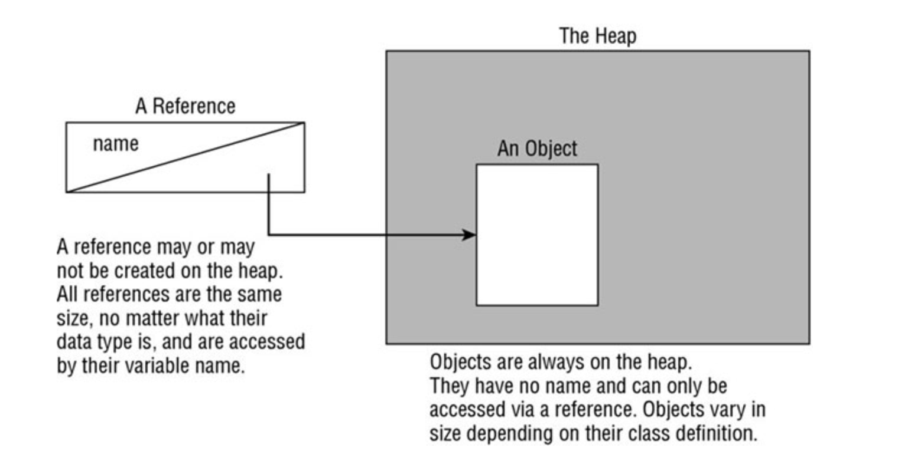

# OCA-8/OCP-11 PREPARATION NOTES 

## Introduction
This repository contains notes about OCA 1ZO-808 and OCP 1ZO-819 certifications, you can contribute to it either adding/updating notes by raising PRs

## Resources

### Books

* Oracle Certified Professional 11 Developer Complete : [Amazon link](https://www.amazon.com/Oracle-Certified-Professional-Developer-Complete/dp/1119619130)

## Notes

## Chapters

### Chapter 1

### Chapter 2: Java building blocks "you have to learn to walk before you can run"

#### Constructors
A constructor allow us to create instance object for a given class. There are two rules that a constructor should match :
    1. the name of the constructor matches the name of the class.
    2. there’s no return type
The compiler provide a "default" constructor that do nothing ! 

#### Instance initializers
Is a block {} that appears *outside* a method, example : 

```java
public class Post {
    public static void main(String... args) {
        System.out.println("I'm the main method");
        Post post = new Post();
    }
    public Post() {
        System.out.println("Hello I'm the constructore");
    }

    {
        System.out.println("Hello I'm an instance block, Before the constructor! I can call fields like name=" + name);
    }
}
```
Instance initializers are executed before the main method.
Any variable that is declared inside a block will not be accessible from outside.

#### Static blocks
Are blocks {} that are prefixed with static, at class level, theys are executed before anything else on the class. Exemple : 

```java
public class Test {
    String name = "Abdel";
    public static void main(String... args) {
        System.out.println("I'm executed before anything in the main");
        Test testObj = new Test();
    }

    public Test() {
        System.out.println("Hello I'm the constructore");
    }

    {
        System.out.println("Hello I'm an instance block, Before the constructor! I can call fields like name=" + name);
    }

    static {
        System.out.println("I'm a static block, I'm executed before instance initializers");
    }
}

```

#### Order of initialization
    1. Static blocks 
    2. Field and initializer blocks (in the order in which they appear in the file).
    3. Constructor

#### Data types
Java support two types of data: 
    * primitive types.
    * reference types

##### Primitive types
Java has 8 built-in data-types (the Java primitive types).
A primitive is just a single value in memory, such as number or character.

| boolean | true/false |
| ------  | ------     |
| byte    | 8 bit     => signed (-/+) number [-128,127] |
| char    | 16 bit    => unsigned number; only positive number are supported |
| short   | 16 bit    => signed number |
| int     | 32 bit |
| long    | 64 bit |
| float    | 32 bit   => require f following the number |
| double  | 64 bit |

> When a number is declared, example: `int sum;` java will reserve 32 bits memory.
> We can use long values with capital 'L' (prefered) or 'l' if the value > int ; otherwise we can ommit the suffix ! 

> you can use *literals* with _ in to assign big values and keep it readable; example : 

```java
int million = 1_000_000;
```

##### Reference types
A reference refers to an object, unlike primitives references do not hold the value of the object they refer to in memory. Instead a reference is like a pointer that stores the memory address where the object is located.

##### Identifiers ( variable names ) naming rules
an identifier is the name of a variable, it should respect some naming rules, such as :

    * identifiers must begin with a letter, a $ symbol, or a _ symbol.
    * identifiers can include numbers, but should not start with them.
    * since java 9, a single underscore _ is not allowed as an identifier.
    * you can not use reserved words (java words)

By convention java use camelCase notation for naming variables; like `int studentNumber;` you can also use snake_cases for constant ( static final ) and enum variable names.

##### Initializing variables
You can declare & initialize variables in the same line, the only condition is that theys should have the same type. 
Also know that the compiler will not let you use a variable that has not been initialized. Example : 

> valid declaration
```java
String name1, name2, name3 = "Luffy";
```
This will declare 3 variables but only one (name3) is initialized.

> Invalid declaration
```java
int number = 3, String name = "Luffy";
```

##### Local variables
A local variable is a variable defined within : constructor, methods, or initializer block. local variables do not have a default value and must be initialized before use.

##### Instance variables vs class variables

- Instance variables often called field , is a value defined within a specific instance of an object.
- Class variables are defined in class level, and accessible from outside, thus aren't related to an specific instance of the class => they are marked with `static` keyword.

##### Default values

| Variable type |   Default init value |
| ------ | ------ |
|   boolean |   false   |
|   byte, short, int, long |   0   |
|   char |   '\u0000' (NUL)   |
|   float, double |   0.0   |
|   All object references |   null   |

##### The var keyword (local variable type inference)
Java 10 has introduced the `var` keyword, it replace **local variables** (only local variables) under certain conditions, example : 

```java
    public void testMethod() {
        var name = "Luffy";
        System.out.println(name);
    }
```

what is not valid with `var`: 

```java
    public class TestVar {
        var name = "String"; // DOESN'T COMPILE

        public void sayHello() {
            int a = 2, var b = 3; // DOESN'T COMPILE
            var name1 = "Luffy", name2 = "Zoro" // DOESN'T COMPILE => Java does not allow var in multiple variable declarations.
            var c = null; // DOESN'T COMPILE
            var d;  // DOESN'T COMPILE => type inference is infered on initialization of the variable
            d = "Hello";
        }
    }

```
The following, is a valid usage of the `var` feature : `var name = (String)null;` since the type is provided !

##### Rules about type inference 
    * A var is used as a local variable in a constructor, method, or initializer block.
    * A var cannot be used in constructor parameters, method parameters, instance variables, or class variables.
    * A var is always initialized on the same line (or statement) where it is declared.
    * The value of a var can change, but the type cannot.
    * A var cannot be initialized with a null value without a type.
    * A var is not permitted in a multiple-variable declaration.
    * A var is a reserved type name but not a reserved word, meaning it can be used as an identifier except as a class, interface, or enum name.

#### Variable scope 
There are 3 types of variable scopes : 

    * Local variables: In scope from declaration to end of block
    * Instance variables: In scope from declaration until object eligible for garbage collection
    * Class variables (static): In scope from declaration until program ends


### Destroying objects
When an object is no more needed it will be destroyed using the garbage collector. The JVM provides multiple kinds of GC.
All java objects are stored in the **heap memory**. 

#### Garbage collecting 
GC is refered as the process of automatically freeing memory on the heap by deleting objects that are no longer reachable in your program 

#### Eligible for GC
eligible for garbage collection refers to an object’s state of no longer being accessible in a program and therefore able to be garbage collected.
Java provides a method called `System.gc()` that call the JVM to kick off the GC process, that doesn't means that the GC will perform right away ! The JVM may perform garbage collection at that moment, or it might be busy and choose not to. The JVM is free to ignore the request.

#### Tracing eligibility 
An object will remain on the memory heap until it's no more reachable; when one of two situations occurs:

    - The object no longer has a reference point ot it !
    - All references to the objects has gone out of scope !

> Do not confuse a reference with the object that it refers to; they are two different entities. The reference is a variable that has a name and can be used to access the contents of an object. A reference can be assigned to another reference, passed to a method, or returned from a method. All references are the same size, no matter what their type is.

> An object sits on the heap and does not have a name. Therefore, you have no way to access an object except through a reference. Objects come in all different shapes and sizes and consume varying amounts of memory. An object cannot be assigned to another object, and an object cannot be passed to a method or returned from a method. It is the object that gets garbage collected, not its reference.

